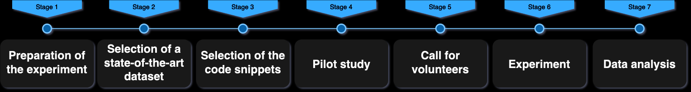

# Eyes on Code Smells: Analyzing Developers' Responses During Code Snippet Analysis

This repository contains supplementary results and the data used in the study "Eyes on Code Smells: Analyzing Developers’ Responses During Code Snippet Analysis". The study investigates how the presence of code smells influences developers' program comprehension using eye-tracking technology.

## Overview

In this study, we conduct an analysis of developers' responses to code smells using eye-tracking technology. We examine 13 code snippets, each potentially containing one of three types of code smells: data class, feature envy or long method. Our objective is to understand the cognitive load these smells impose on developers during program comprehension. Data was collected from 12 participants, who performed tasks involving the analysis of these code snippets. We measured fixation to determine how different code smells influence developers' attention and cognitive effort. Using metrics such as Average Fixation Duration (AFD) and fixation count (FC), our study provides insights into the impact of code smells on developers' cognitive processes.

-----

## Results

To demonstrate our results, we used normalized qualitative data about the perceived complexity of the code snippet by the participants and quantitative fixation data from the eye tracker. Our results indicate that the code snippets considered more complex by the developers required more fixations, resulting in higher cognitive effort. This is particularly evident in the case of the "long method" code smells. Additionally, we noted that the "data class" code smell presents a lower cognitive effort compared to other code smells, as reflected by lower fixation values.

--------

## Data

### Developers Fixations

The *01_12_merged_fixation.tsv* file contains the fixations data of the developers who participated in the study.

Fixations were extracted from databases generated by iTrace-Tools. Due to the size of each generated database, we extracted the table that represented each developer's fixation data and aggregated it into a .tsv file.

### Developers Answers

The *answers_experiments.tsv* file contains the answers of the developers who participated in the study.

### Data Dictionary

The *data_dictionary.pdf* provides the data dictionary for the features collected with the iTrace-Tools from the *01_12_merged_fixation.tsv* file and the questions for each column in the answers_experiments.tsv file.

### Code Snippets

The *code_snippets.xlsx* file contains the data for each code snippet extracted from MLCQ dataset that was analyzed by the developers who participated in the study.

